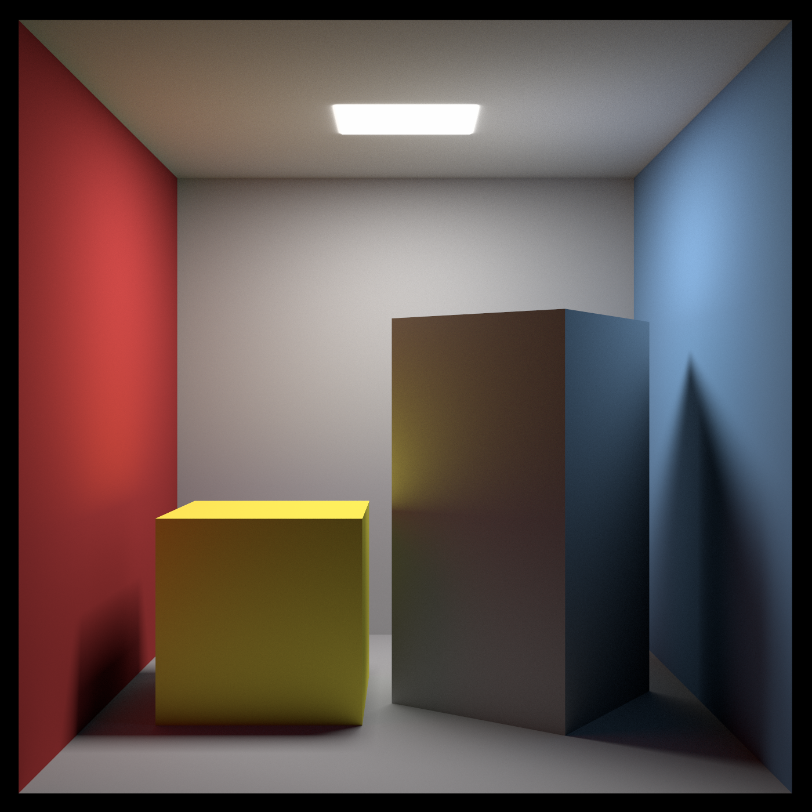

# Student Project: Python Raytracer



## How to setup

1. Create the virtual Python environment
   
   ```shell
   py -m venv venv
   ```

2. Activate the environment
   
   ```shell
   # On Windows:
   $> venv\Scripts\activate
   # On Linux or MacOS
   $> source venv/bin/activate
   ```

3. Install the requirements
   
   ```
   pip install -r requirements.txt
   ```

## Files and Folders

### Folders

| Foldername | Description                                          |
| ---------- | ---------------------------------------------------- |
| notebooks  | We used Jupyter notebooks to document the raytracer  |
| raypy      | raypy is the python package that holds the raytracer |
| results    | the results folder holds some renderd images         |

### Files

| Filename                                 | Description                                        |
| ---------------------------------------- | -------------------------------------------------- |
| main.py                                  | Open the main.py an run the raytracer yourself     |
| notebooks\rayTracing.ipynb               | The notebook that explains how the raytracer works |
| results\result-1400x1400-700_samples.png | A final render that took about 28 hours            |

## How to use

- Open the `main.py` and run the raytracer yourself! Be aware that rendering a picture yourself will take some time. 
  
  Change the values for `WIDTH`, `HEIGHT` or `SAMPLES` to influence the render time.

- Open the notebook at `notebooks\rayTracing.ipynb` and read through the documentation of the raytracer.
